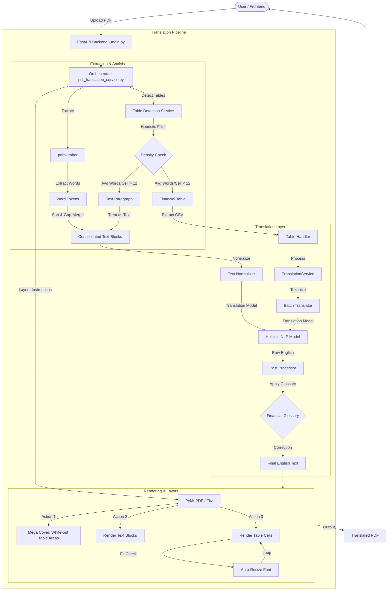

# PDF Translation System Architecture

## Overview
This system is an **Advanced Financial Document Translation Pipeline** designed to convert Arabic PDFs to English while preserving complex layouts, tables, and financial formatting. It specifically addresses challenges like text overlap, fragmented Arabic tokens, and accurate table reconstruction.

## System Architecture Diagram

## Core Components

### 1. **Orchestrator (`pdf_translation_service.py`)**
 The central controller that manages the document lifecycle. It iterates through pages, invokes detectors, and coordinates the translation and rendering phases. It now includes intelligent filtering to distinguish between **Data Tables** and **Multi-Column Text**.

### 2. **Table Detection & Handling (`services/tables_service/`)**
 - **Detection (`table_detection_service.py`)**: Uses a custom heuristic algorithm to find table regions based on vertical and horizontal alignment.
 - **Density Filter**: A crucial post-detection step that analyzes "Words Per Cell". 
   - *High Density (>12 words)*: Classified as a Text Layout (Paragraph) -> Sent to Text Translation.
   - *Low Density (<12 words)*: Classified as a Data Table -> Sent to Table Translation.
 - **Gap-Based Merging (`table_handler.py`)**: Solves the "Fragmented Arabic" issue by merging disjointed text tokens based on proximity before translation.

### 3. **Translation Engine**
 - **Model**: `Helsinki-NLP/opus-mt-tc-big-ar-en` (Primary) with fallback.
 - **Normalization**: Converts Arabic numerals (١٢٣) to English (123) and standardizes punctuation.
 - **Financial Glossary (`translation_service.py`)**: A post-processing layer that enforces standard financial terminology (e.g., correcting "Untraded liabilities" to "Non-current liabilities").

### 4. **Rendering Engine (In-Place)**
 - **Mega Cover**: Before rendering a table, the system draws a single white rectangle over the *entire* table area. This prevents original Arabic text from bleeding through the gaps between English rows.
 - **Auto-Resizing**: Dynamically reduces font size (down to 4pt) to ensure translated English text fits exactly within the original cell boundaries without overlapping neighbors.

## Data Flow
1.  **Upload**: User uploads a PDF.
2.  **Detection**: System scans for tables. Candidates are filtered by text density.
3.  **Extraction**: 
    -   Tables are converted to CSV-like structures.
    -   Text outside tables is grouped into blocks.
4.  **Translation**: 
    -   Text is batch-translated.
    -   Financial terms are corrected via Glossary.
5.  **Rendering**: 
    -   Original PDF page is modified in-place.
    -   Table areas are whited out ("Mega Cover").
    -   Translated text is drawn with precise alignment.
6.  **Output**: Final PDF is returned to the user.

## Future Roadmaps
-   **Structure Recognition**: Moving from heuristics to AI-based table detection (e.g., Table Transformer).
-   **Font Matching**: Attempting to match the weight and style of the original Arabic font.
-   **Vector Search**: Integrating RAG flows more deeply for "Chat with PDF" features.

