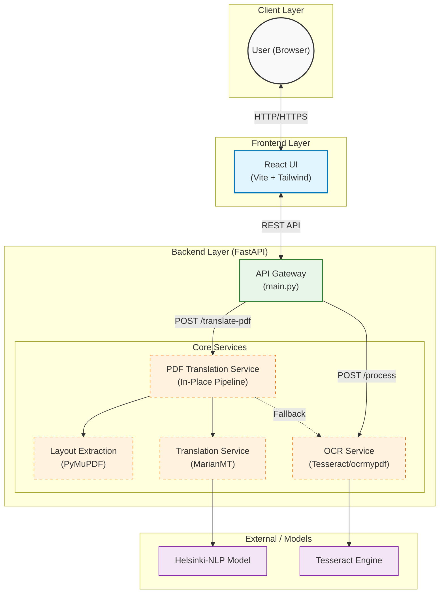
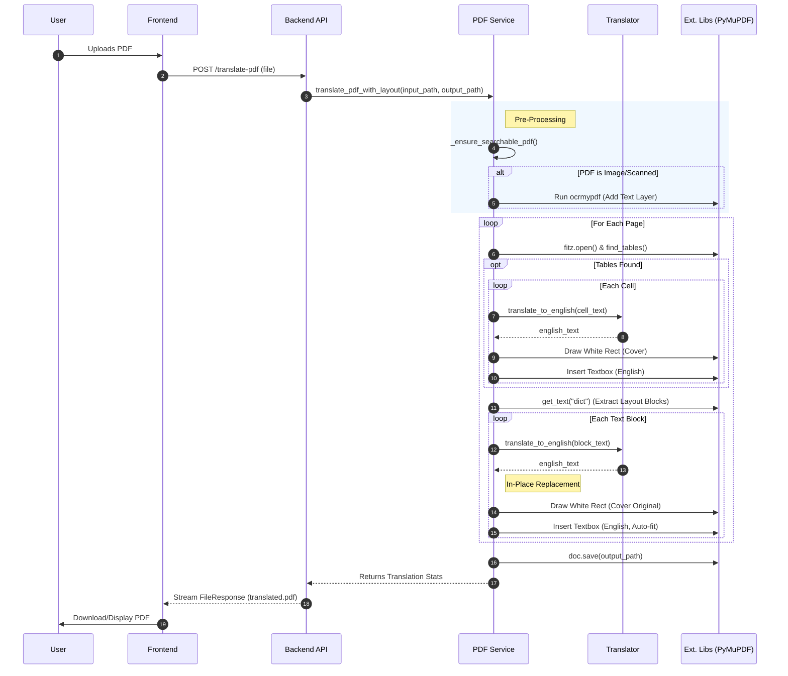

# SAMPLE-OCR Architecture and Processing Flow

This document explains the backend architecture and the end-to-end processing flow for Arabic-to-English PDF translation with layout preservation.

## Overview
- **Framework**: FastAPI (backend)
- **Core services** (backend/services):
  - `layout_extraction_service.py`: Extracts text blocks (with bounding boxes) from PDFs using PyMuPDF/pdfplumber/OCR.
  - `table_extraction_service.py`: Extracts tables and cell positions via Camelot (optional) or pdfplumber; OCR fallback from blocks.
  - `translate_service.py`: Translates Arabic text to English using Transformers (MarianMT, with better model preference).
  - `pdf_translation_service.py`: Orchestrates in-place PDF translation with PyMuPDF to preserve exact layout.
  - `pdf_renderer_service.py`: ReportLab-based renderer (legacy/reconstruction path); currently not used by the strict in-place flow.
  - `ocr_service.py`: Standalone OCR text extractor for the `/process` endpoint.

- **Primary endpoints** (backend/main.py):
  - `POST /process`: OCR-only text extraction and translation, returns JSON with Arabic and English text.
  - `POST /translate-pdf`: Full PDF-to-PDF translation with layout preservation, returns a translated PDF.

## System Architecture

## Sequence Diagram: PDF Translation Flow

## High-Level Flow
1. **Client Upload**: User uploads a PDF via the React frontend.
2. **Searchability Check**: Backend checks if the PDF has a text layer; if not, it applies OCR (`ocrmypdf`) to make it searchable.
3. **In-Place Translation**: 
    - The `pdf_translation_service` processes the PDF page by page.
    - It detects **Tables** first to handle them cell-by-cell.
    - It then processes remaining **Text Blocks**, translating Arabic text to English.
4. **Layout Preservation**: 
    - Original text is visually "erased" ensuring the background is clean.
    - Translated English text is drawn into the exact same coordinates (bounding box).
    - Font size is dynamically adjusted to fit the translated text within the box.
5. **Response**: The modified PDF is saved and streamed back to the user.

## Detailed Components
- **layout_extraction_service**
  - Prefers PyMuPDF (`get_text('dict')`) for digital PDFs; falls back to pdfplumber; lastly OCR (pytesseract) with multiple PSMs.
  - Produces `TextBlock` objects with coordinates using bottom-left origin (x0,y0,x1,y1), per page.
  - Post-processes to remove duplicates/overlaps and maintain reading order (top→bottom, left→right).

- **pdf_translation_service**
  - `_ensure_searchable_pdf`: Heuristically detects image-only PDFs; runs `ocrmypdf` (if available) to add a text layer.
  - `translate_pdf_inplace`: Main in-place path using PyMuPDF rectangles. Converts between coordinate systems (TextBlock bottom-left to fitz top-left) and writes translated text sized to fit blocks. Collects stats.
  - `translate_pdf_with_layout`: Enforces the in-place method only (reconstruction disabled for fidelity).

- **translate_service**
  - Loads a MarianMT model/tokenizer; prefers `Helsinki-NLP/opus-mt-tc-big-ar-en`, falls back to `Helsinki-NLP/opus-mt-ar-en`.
  - Splits text into sentences while preserving line breaks; translates each sentence with beam search; validates to filter clearly bad outputs or untranslated Arabic.

- **table_extraction_service**
  - Attempts Camelot (`lattice`/`stream`) if installed; otherwise uses pdfplumber.
  - Returns `Table` with `TableCell`s including per-cell positions and page numbers.
  - OCR fallback: `extract_tables_from_ocr` heuristically groups aligned `TextBlock`s into table rows/columns.
  - Note: In strict in-place mode, tables are translated as part of generic text blocks; dedicated table-aware rendering is not required but available.

- **pdf_renderer_service**
  - ReportLab-based renderer for reconstructing PDFs from extracted blocks/tables. Currently superseded by the in-place method; kept for reference or future use.

- **ocr_service**
  - Standalone OCR pipeline used by `/process`. Converts pages to high-DPI images, preprocesses with OpenCV (denoise, binarize, deskew), runs Tesseract Arabic with multiple PSMs, merges best results.

## Data Models
- `TextBlock` (layout_extraction_service)
  - Fields: `text`, `x0`, `y0`, `x1`, `y1`, `width`, `height`, `page_num`, `is_table`, `font_size`, `font_name`.
- `TableCell` (table_extraction_service)
  - Fields: `text`, `row`, `col`, `x0`, `y0`, `x1`, `y1`, `width`, `height`, `page_num`.
- `Table` (table_extraction_service)
  - Fields: `cells[]`, `page_num`, `num_rows`, `num_cols`, `bbox()`.

## Endpoints
- `GET /` Health/info
  - Returns available endpoints.

- `POST /process` (JSON result)
  - Input: multipart upload `file` (PDF)
  - Output: `{ arabic_text, english_text }`
  - Errors: 400 for non-PDF/empty/invalid; 500 for processing errors.

- `POST /translate-pdf` (PDF result)
  - Input: multipart upload `file` (PDF)
  - Output: Translated PDF file; response headers include `X-Translation-Stats`.
  - Errors: 400 for non-PDF/empty/invalid; 500 for processing errors.

## Coordinate Systems
- Extraction services use bottom-left origin (PDF standard) for `TextBlock` and `TableCell`.
- PyMuPDF uses top-left origin; conversion is handled inside `translate_pdf_inplace` when creating fitz `Rect`s.

## Dependencies and Optional Tools
- Core: FastAPI, PyMuPDF (fitz), pdfplumber, pytesseract, transformers/torch, pdf2image, OpenCV.
- Optional: `ocrmypdf` (adds text layer to scanned PDFs), `camelot-py` (better table extraction), CUDA for GPU acceleration.

## Tech Stack Specification

- **Backend**
  - Framework: FastAPI, Uvicorn
  - OCR: pytesseract (Tesseract ara), pdf2image, OpenCV
  - PDF processing: PyMuPDF (fitz), pdfplumber, PyPDF2 (aux)
  - Translation: Hugging Face Transformers (MarianMT), Torch
  - Table extraction: camelot-py (optional), pandas
  - Rendering (legacy): ReportLab
  - Utilities: python-multipart, numpy

- **Frontend**
  - React 18, Vite, TailwindCSS
  - TypeScript types for React (dev), @vitejs/plugin-react

- **Runtime/Environment**
  - Tesseract OCR with Arabic language data installed
  - Optional: ocrmypdf for scanned PDFs; CUDA-enabled PyTorch for GPU acceleration
  - CORS enabled for localhost dev (5173/3000)

## Configuration and Environment
- No explicit `.env` is required by default.
- Tesseract installation and Arabic language data must be available to pytesseract.
- If using GPU, ensure CUDA-compatible torch is installed.

## Error Handling
- Endpoints validate file type, non-empty content, and basic PDF header.
- Clear 400/500 error messages are returned with actionable details when possible.
- Services log warnings for fallbacks (e.g., missing optional deps, bad translations, OCR failures).

## Performance Notes
- Model loading is cached; first request incurs model load time.
- In-place editing avoids full page rasterization and better preserves layout.
- OCR and high DPI conversions can be slow; only used if needed.

## Running Locally
- Start API: `uvicorn backend.main:app --reload`
- Access endpoints at `http://localhost:8000`.
- CORS allows `http://localhost:5173` and `http://localhost:3000` by default.

## Typical Sequence (translate-pdf)
1. Upload PDF → `POST /translate-pdf`.
2. Save to temp → validate PDF header.
3. `_ensure_searchable_pdf` → optional OCR layer.
4. `extract_text_blocks_with_layout` → list of `TextBlock`s by page.
5. For each Arabic block → translate → replace in-place (fitz `Rect`).
6. Save output PDF → return FileResponse with stats.

## Notes and Limitations
- If PyMuPDF is unavailable, in-place translation is disabled; the endpoint will error.
- Translation quality depends on model; long or noisy text blocks may be filtered.
- Some complex glyph shaping/ligatures may not be perfectly reproduced post-translation.
