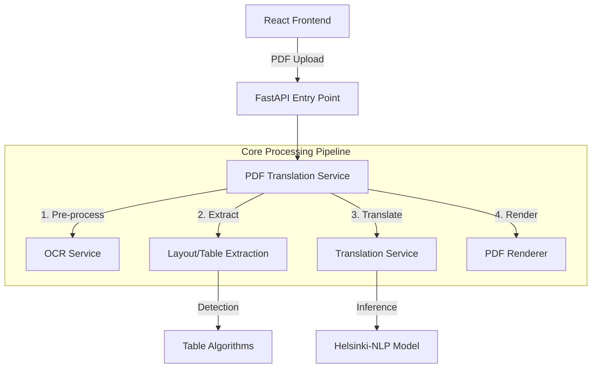

# Architecture & Optimization Documentation

## 1. Executive Summary

This application is a specialized **Arabic-to-English PDF Translator** designed for financial documents. It prioritizes layout preservation, accuracy, and processing speed. The core innovation lies in its **"Global De-duplicated Batch Processing"** pipeline, which significantly reduces translation time for repetitive documents (like financial statements) while maintaining high fidelity.

---

## 2. System Architecture

The application is built as a monolithic web service with a clear separation of concerns between the API layer, orchestration services, and core processing logic.

### Technology Stack
- **Frontend:** React + Vite + TailwindCSS (Single Page Application)
- **Backend:** FastAPI (Python 3.9+)
- **PDF Processing:** PyMuPDF (`fitz`), `ocrmypdf`, `pdf2image`
- **AI/ML:** HuggingFace Transformers (PyTorch)
- **Model:** `Helsinki-NLP/opus-mt-tc-big-ar-en` (finetuned for Arabic-English)

### Component Diagram

## 3. End-to-End Workflow

The translation process follows a strict **"Extract-Translate-Apply"** pattern, modified into a **Three-Phase Pipeline** for performance.

### Phase 0: Preprocessing
*Goal: Ensure the PDF is machine-readable.*
1.  **Check Layer:** The system scans the PDF for an existing text layer.
2.  **OCR Injection:** If the PDF is scanned (image-based), `ocrmypdf` runs to generate a hidden text layer over the image. This allows `PyMuPDF` to extract text from "images".

### Phase 1: Collection (The "Harvester")
*Goal: Gather every piece of text and its location, but do NOT translate yet.*
1.  **Iterate Pages:** Loops through every page of the document.
2.  **Table Detection:** Uses specialized algorithms (Maryum Service or heuristic fallback) to identify grid structures.
    -   *Why?* Tables must be translated cell-by-cell to keep columns aligned.
3.  **Text Block Extraction:** Identifies paragraphs and loose text outside tables.
4.  **Queueing:** Instead of translating immediately, every text segment (cell or paragraph) is cleaned, normalized, and added to a **Global Translation Queue**. A pointer (index) is saved with the layout coordinates.

### Phase 2: Translation ( The "Optimizer")
*Goal: Translate text as efficiently as possible.*
1.  **Deduplication:** The global queue is converted to a `set` of unique strings.
    -   *Impact:* In financial reports, terms like "Assets", "Current Year", "SAR", and "Notes" appear hundreds of times. This step reduces the workload by 40-70%.
2.  **Numeric Bypass:** Pure numbers (e.g., "٢٠٢٤", "١,٥٠٠") are detected via Regex and converted directly without touching the AI model.
    -   *Benefit:* 100% accuracy for financial figures and near-zero latency.
3.  **Batch Inference:** Unique text strings are grouped into batches (size ~32) and sent to the transformer model.
    -   *Benefit:* Maximizes GPU/MPS parallel processing capabilities.
4.  **Validation:** Each translation is checked for "bad hallucinations" (loops, nonsense). Failures are retried with different beam search parameters.

### Phase 3: Application (The "Builder")
*Goal: Reconstruct the document.*
1.  **Map Back:** The translated unique strings are mapped back to their original positions using the indices saved in Phase 1.
2.  **Erase & Write:**
    -   Draws a white rectangle over the original Arabic text.
    -   Calculates the best font size to fit the English text into the original bounding box.
    -   Inserts the English text.
3.  **Output:** Saves the modified PDF.

---

## 4. Optimization Deep Dive

The following optimizations yielded the most significant performance gains:

### A. Global Deduplication
-   **Problem:** Translating a 100-page document sequentially meant translating the header "Annual Report" 100 times.
-   **Solution:** We extract *all* text first, then translate only the unique set.
-   **Code Reference:** `pdf_translation_service.py` -> `translate_pdf_inplace` (Phase 2 section).
-   **Result:** Reduced AI inference calls by ~60% for structured documents.

### B. Batch Processing
-   **Problem:** Calling `model.generate()` for every single sentence has high overhead (loading tensors, context switching).
-   **Solution:** We aggregate texts into lists and pass them to the model in one go.
-   **Code Reference:** `translate_service.py` -> `translate_batch`.
-   **Result:** ~3-5x speedup compared to sequential processing.

### C. Numeric & Symbol Fast-Path
-   **Problem:** LLMs are surprisingly bad at copying numbers (hallucination risk) and slower than simple code.
-   **Solution:** A Regex check `^[\d\s\.,\-%$]+$` intercepts numeric strings before the model sees them.
-   **Code Reference:** `translate_service.py` -> `translate_batch` -> `numeric_pattern` check.
-   **Result:** Instant processing for ~20% of content in financial tables; guarantees 100% numerical accuracy.

### D. Sentence Splitting (Accuracy Optimization)
-   **Problem:** Long paragraphs confuse the model, leading to skipped sentences in the middle.
-   **Solution:** We split paragraphs by punctuation (`.`, `!`, `?`), translate sentences individually, and rejoin them.
-   **Code Reference:** `translate_service.py` -> `translate_to_english`.
-   **Result:** Higher translation quality and fewer "missing text" errors.

---

## 5. Directory Structure Key

-   **`backend/services/pdf_translation_service.py`**: The "Boss". Manages the 3-phase pipeline.
-   **`backend/services/translate_service.py`**: The "Worker". Handles the AI model, caching, batching, and logic.
-   **`backend/services/table_extraction_service.py`**: The "Specialist". Handles the complex geometry of identifying rows and columns.
